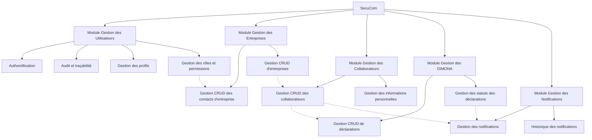
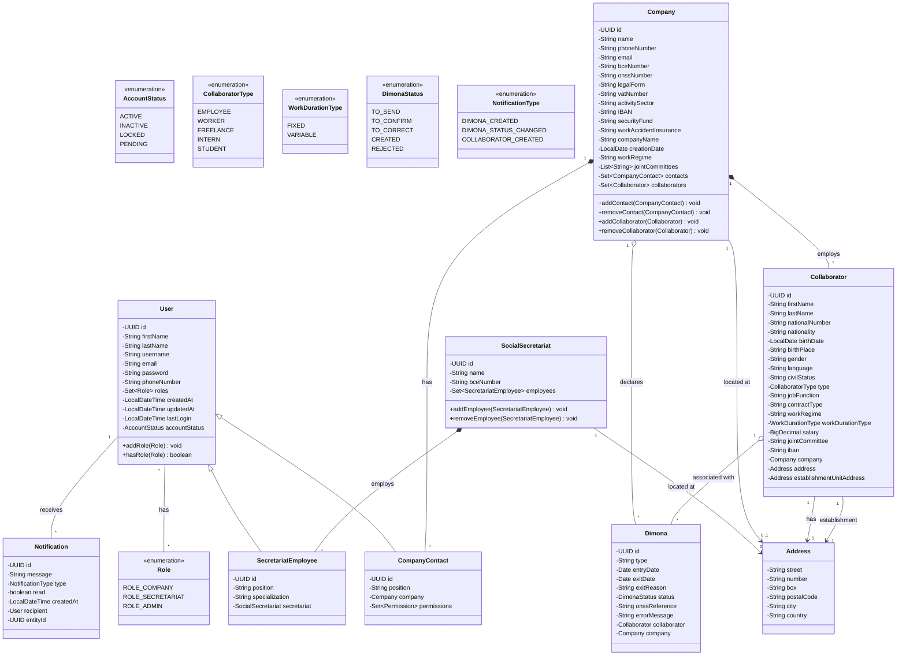
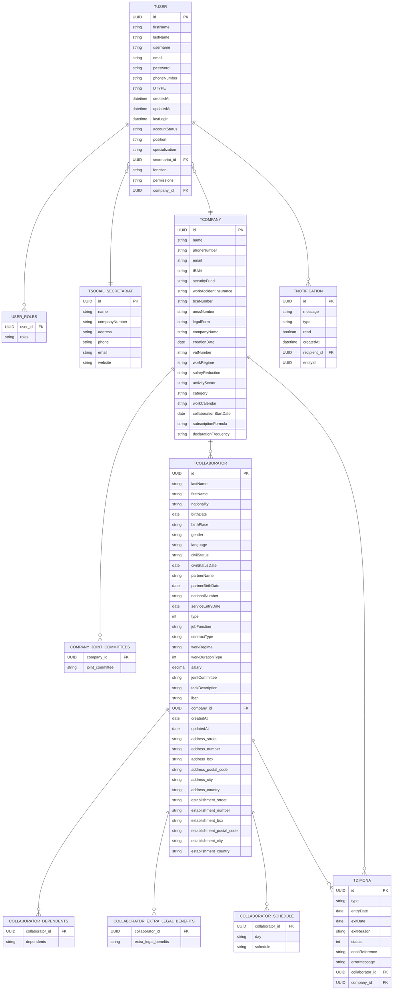
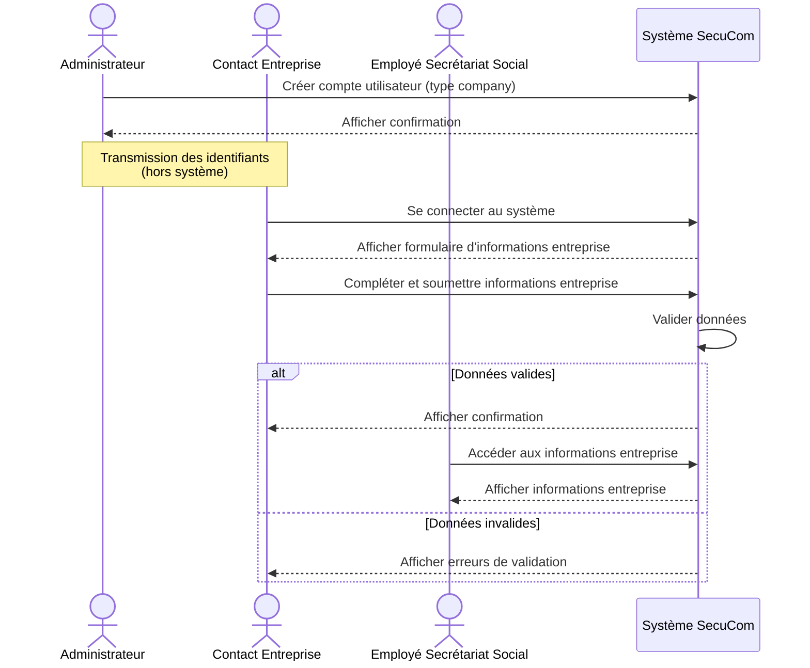
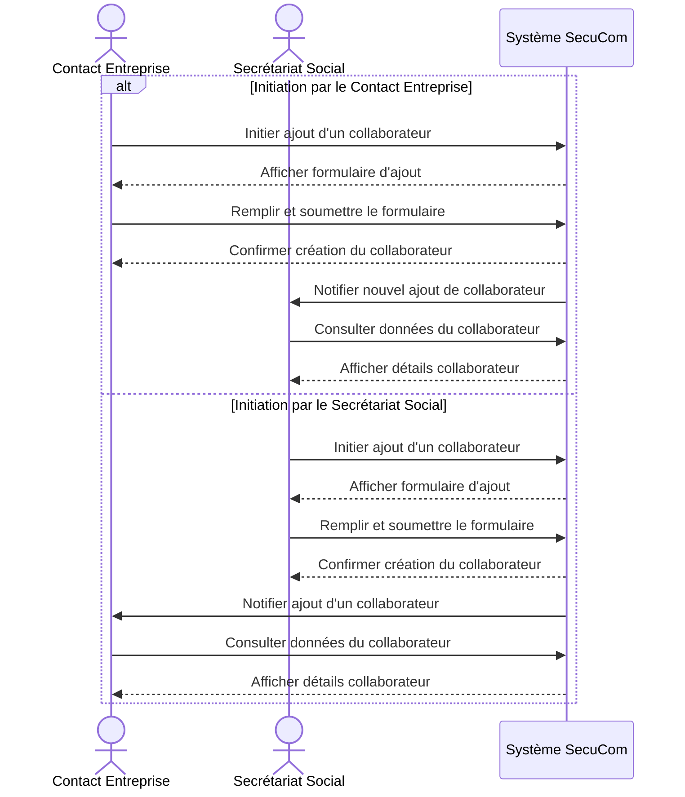
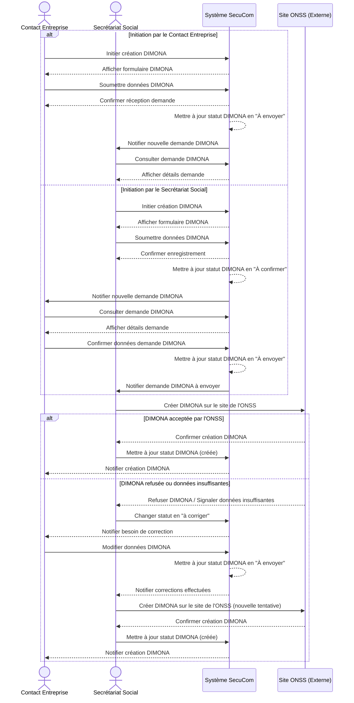

# Diagrammes MermaidJS pour la section 6 (Analyse)

## 6.1 Diagramme de composants



## 6.2 Diagramme de classes



## 6.3 Diagramme d'entités relationnelles



## 6.4 Diagrammes de séquences

### 6.4.1 Cas d'utilisation : Création d'une entreprise



### 6.4.2 Cas d'utilisation : Ajout d'un employé



### 6.4.3 Cas d'utilisation : Création d'une déclaration DIMONA



## 6.5 Diagramme d'activité

```mermaid
stateDiagram-v2
    [*] --> CreationEntreprise
    CreationEntreprise --> AjoutContact: Entreprise créée
    AjoutContact --> AjoutCollaborateur: Contact ajouté
    
    AjoutCollaborateur --> CreationDIMONA: Collaborateur ajouté
    CreationDIMONA --> SuiviDIMONA: DIMONA créée
    
    state SuiviDIMONA {
        [*] --> EnAttente
        EnAttente --> Acceptee: Confirmation ONSS
        EnAttente --> Rejetee: Erreur détectée
        Rejetee --> Corrigee: Correction effectuée
        Corrigee --> EnAttente: Nouvelle soumission
    }
    
    SuiviDIMONA --> EnregistrementPrestations: DIMONA acceptée
    EnregistrementPrestations --> GenerationFichePaie: Prestations validées
    GenerationFichePaie --> [*]: Fiche de paie générée
    
    state fork_state <<fork>>
    GenerationFichePaie --> fork_state
    fork_state --> ArchivageDocuments
    fork_state --> EnvoiDocuments
    
    ArchivageDocuments --> [*]
    EnvoiDocuments --> [*]
